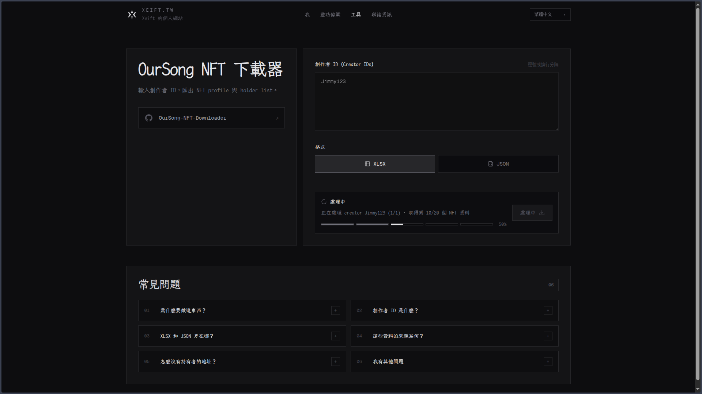

# OurSong NFT Downloader

OurSong NFT 資料下載器，可匯出創作者 NFT profile 與 holder list，並產生 JSON 或 XLSX 檔。



## 如何使用？

網頁版工具：https://xeift.tw/zh-TW/tools/oursong-nft-downloader

## 本地執行

```bash
npm install
cp .env.example .env
npm run dev
```

`.env` 需要設定：

```bash
OURSONG_API_KEY=your_oursong_api_key
```

開啟 `http://localhost:3000`。

## 指令

```bash
npm run dev
npm run build
npm run lint
```

## 近期更新

> 2026.5.6 更新：目前仍可正常使用，已深度重構前後端。
>
> 工具連結：https://xeift.tw/zh-TW/tools/oursong-nft-downloader

> ~~2025.6.9 更新：目前仍可正常使用~~
>
> ~~工具連結：https://www.omelet.im:2087/oursong-data-download~~
